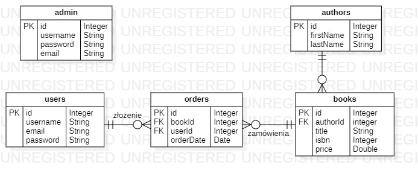

## Spis treści
1. [Specyfikacja wymagań systemowych](#1specyfikacja-wymagań-systemowych)
    1. [Cel systemu](#cel_systemu),
    2. [Wymagania funkcjonalne](#wymagania_funkcjonalne),
    3. [Wymagania niefunkcjonalne](#wymagania_niefunkcjonalne),
2. [Dokumentacja techniczna](#2dokumentacja_techniczna)
3. [Dokumentacja użytkownika](#3dokumentacja_uzytkownika)

#

&nbsp;

# 1.Specyfikacja wymagań systemowych
## Cel systemu
Celem internetowej księgarni jest umożliwienie klientom dokonania zakupu książek bez konieczności wychodzenia z domu. Użytkownik zarejestrowany może przeglądać produkty jakie znajdują się na stronie, wszyscy użytkownicy mogą wyszukiwać produkty według kategorii. Natomiast po zarejestrowaniu i zalogowaniu jest w stanie dokonać zamówienia danego produktu. Dodatkowo każdy klient, który posiada konto na stronie ma możliwość wystawienia recenzji jak i oceny danemu produktowi. Strona księgarni dzięki swojej responsywności jest dostępna nie tylko na komputery stacjonarne ale również urządzenia mobilne.
## Wymagania funkcjonalne
Zalogowani użytkownicy będą mogli:
- dokonywać zamówień książek
- wystawiać ocenę każdej książce.

Natomiast niezalogowani użytkownicy będą mogli:
- przeglądać produkty
- wybierać tytuły z danej kategorii.
## Wymagania niefunkcjonalne
Użytkownicy będą mogli:
- sortować książki pod względem wystawionych ocen,
- wyszukiwać tytuły wybranego autora
- dodać zdjęcie okładki książki(tylko dla zalogowanych)
&nbsp;
# 2. Dokumentacja techniczna
## Diagram bazy danych

Zalogowany użytkownik dokonuje zamówienia. Może on dokonać większej liczby zamówień, jednak jedno zamówienie jest przypisane dokładnie do jednego użytkownika. To samo dotyczy książki występującej w kilku zamówieniach jednak każde zamówienie jest przypisane do jednej książki. Podobnie jest z autorami: jeden autor może posiadać kilka książek jednak jedna książka posiada dokładnie jednego autora.
Skróty:
PK - oznacza klucz główny tabeli, czyli atrybut jednoznacznie określający każde wystąpienie danej encji.
FK - oznacza klucz obcy, który wskazuje na klucz główny innej tabeli np. w tabeli books klucz obcy wskazuje na klucz główny z tabeli authors.
&nbsp;
# 3. Dokumentacja użytkownika
